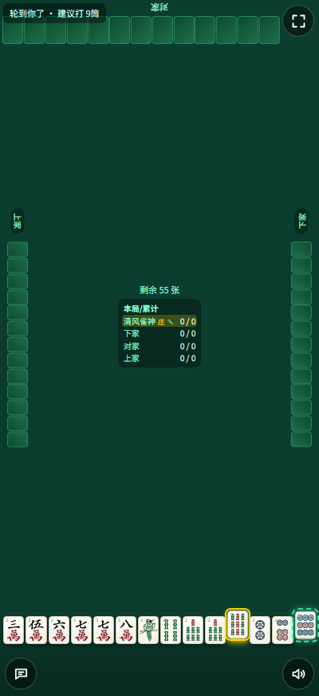
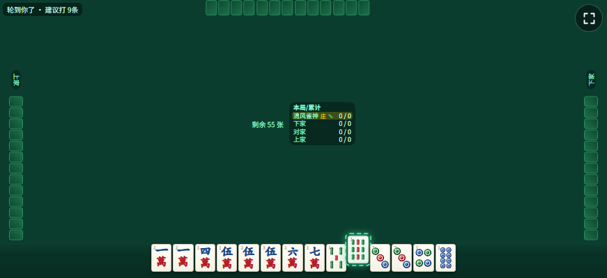
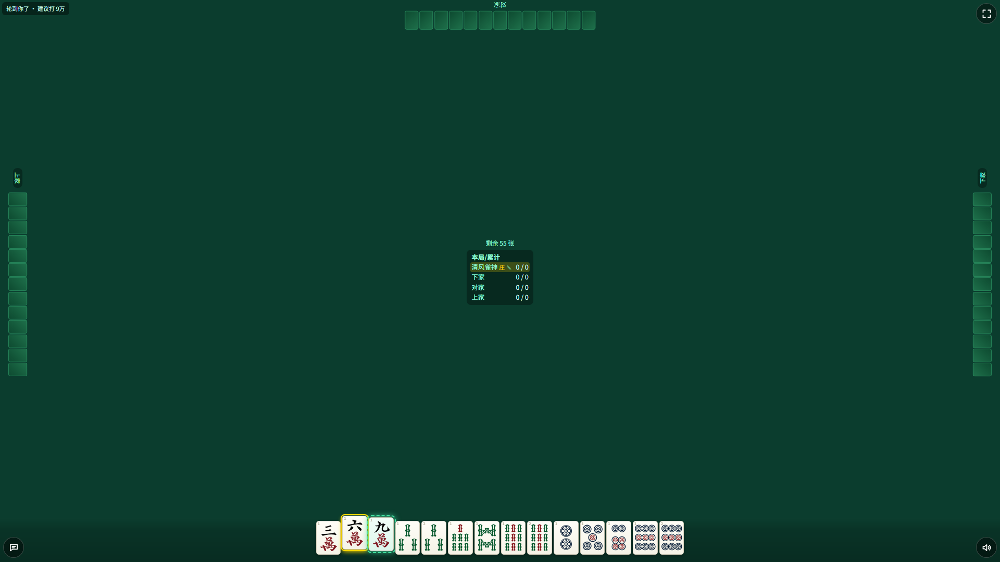
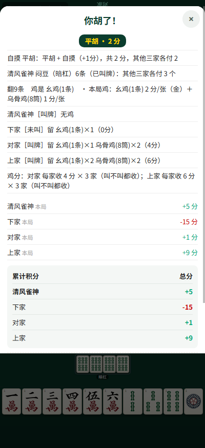

# 贵阳捉鸡麻将（单文件网页版）

一个**只有一个 HTML 文件**的贵阳捉鸡麻将：双击就能玩，不用安装、不联网，手机上也能玩。
内置三家电脑对手，玩法含牌型、豆（杠）、鸡、报听、吃炮通行证等全套贵阳规矩。

## 怎么玩

1. 双击 `index.html`（或发到手机上用浏览器打开）就能开始。
2. **点牌两次才打出**：第一次点 → 牌**弹起来**（预选）；再点同一张才真的打出去。
   中途点别的牌就改成那一张（旧的自动收回）——防误触。
3. **碰 / 杠 / 胡**：同时能做的动作会**全部**列在底部按钮里，点一下即可（如「胡 清大对｜碰｜过」）。
4. 想「添加到主屏 / 有图标 / 全屏」：把 `index.html`、`manifest.webmanifest`、`icon-192.png`、`icon-512.png`
   四个文件放同一目录（自己玩只拷 `index.html` 一个文件也够）。
5. **右上角是全屏按钮**；**右下角是 🔊 音效开关**，**左下角是 🗣 语音开关**（两个开关都会记住状态）。
   **语音**会用系统语音念出**打出的牌**（如「一万」「六筒」）；它与音效**互不影响**，可以只开一个。

---

## 在线体验

[http://www.buez.cn:8088/mj/index.html](http://www.buez.cn:8088/mj/index.html)

## 界面预览

| 手机竖屏 | 手机横屏 |
|---|---|
|  |  |

| 桌面 1920×1080 | 结算窗（得分 / 未摸到的牌 / 再来一局） |
|---|---|
|  |  |

## 一局的总分怎么来

```
分数 = 牌型分值（**取最高的一种**）
     + 自摸 +1 ／ 杠上花 +1
     × 抢杠胡 ×4 ／ 热炮 ×2
另有**独立**结算的几笔：豆（杠分）· 鸡分（幺鸡/乌骨鸡/冲锋鸡/责任鸡）· 开局跟
```

- **牌型取最高、不叠加**：清一色 + 大对子 → 取「清大对 15」，不是 10+5。
- 下面逐节说明每一项；**鸡牌**的完整规则（谁付给谁、归属、完整算例）在后面的「鸡牌规则与结算」一章。

## 牌型与分值

### 1. 分值表

| 牌型 / 附加 | 分值 | 判定条件（怎么算出来的） |
|---|---|---|
| **天胡** | 33 | **庄家第一次摸牌**就自摸（此前没打过牌） |
| **地胡** | 23 | **闲家第一次摸牌**就自摸 |
| **天听** | 34 | **闲家**起手即叫牌并按「报听」（报听按钮；之后摸什么打什么，不能换牌、不能碰杠） |
| **报听** | 17 | **庄家**起手即叫牌并报听 |
| **清龙七对** | 20 | 七个对子 + 至少 1 组「四归一」（4 张相同算 2 个对子）+ **整副同一门** |
| **清七对** | 17 | 七个对子 + 整副同一门 |
| **大吊车** | 17 | **4 副露**（碰/杠）+ 单钓（手里只剩 1 张等对） |
| **清大对** | 15 | 全刻子（4 组刻子 + 1 对将）+ 整副同一门 |
| **龙七对** | 10 | 七个对子 + 至少 1 组四归一 |
| **清一色** | 10 | 顺子牌型 + 整副同一门 |
| **七对** | 7 | 七个对子（**不能有副露**） |
| **大对子** | 5 | 全刻子（4 组刻子 + 1 对将；**碰/杠出来的也算**） |
| **平胡** | 1 | 其余（顺子牌型） |
| **自摸** | **+1** | 自己摸到胡的那张（平胡 1 → 2 分） |
| **杠上花** | **+1** | 杠后**补摸**的那张牌正好自摸胡 |
| **抢杠胡** | **×4** | 别人**补杠**的那张牌正好被你胡 → 补杠者**一家包赔**（付全部分） |
| **热炮**（杠上炮） | **×2** | 点炮者**杠后打出的第一张牌**点了炮；同时他刚成的那个豆**撤销** |

> 前 13 行是牌型，**只取最高的一种**；后 4 行是附加项（自摸 / 杠上花 / 抢杠胡 / 热炮），
> 与选中的那一种牌型**一起算**。

**「清」怎么判**：手牌 **+ 副露一起**看，全部同一门（万/条/筒）才算。

> 例：手里全是万、但碰的是筒 → **不算清**（是「大对子 5」，不是「清大对 15」）。

**特殊牌型说明**

- **天胡 / 地胡**：只在「本局第一次摸牌」那一刻成立（庄家叫天胡、闲家叫地胡）；第二次摸牌自摸不算。
  点炮胡**不算**天胡/地胡（它们都是自摸）。
- **报听 / 天听**：按下「报听」后不能再换牌，摸到什么打什么，也不能碰杠；
  牌型分值按 17 / 34 与手上的实际牌型**取最高**。
- **四归一**：4 张相同牌（如 4 张六筒）在七对里算 **2 个对子** —— 有它就叫「龙七对」。
- **大吊车**：4 副露之后手里只剩 1 张（单钓），任何一张配成对就胡，17 分。

### 2. 豆（杠分）

**每个豆一律 3 分**，方向由「**杠家自己叫没叫牌**」决定：

| 杠法 | 名字 | 杠家**已叫牌** | 杠家**未叫牌** |
|---|---|---|---|
| 暗杠 | **闷豆** | 其他三家各付 **3**（共收 9） | **倒赔**给每个叫牌家各 3（三家都叫 → 共出 9） |
| 补杠 | **爬坡豆**（转弯豆） | 其他三家各付 **3**（共收 9） | 同上 |
| 明杠 | **点豆** | **只有放杠那家**付 3，另外两家不牵动 | 倒赔给**放杠那家** 3（前提：他也叫牌；他没叫就不用给） |

- **闷豆与爬坡豆同分**（都 3）—— 不分 2 / 3 / 1。
- **点豆只跟放杠那一家结算**；只有自杠（暗杠/补杠）才牵动三家。
- **未叫牌 = 倒赔**：杠家未叫牌时，要**赔给叫牌家**。
- 场上一个叫牌家都没有 → 无人可赔，这个豆不结算。
- **热炮**：点炮者刚成的那个豆**撤销**。

### 3. 通行证：豆决定你能不能吃炮

- **手里有豆（杠过）** → **平胡也能吃炮**（别人点炮你能胡）。
- **没有豆** → 只有**大对子（5 分）及以上**的牌型才能吃炮；**平胡/鸡胡只能自摸**。

### 4. 鸡分

| 鸡 | 牌面 | 什么时候算鸡 | 分值 |
|---|---|---|---|
| **幺鸡** | 1条 | 整局都算 | **1 分/张**；翻到 **9条** → **2 分/张** |
| **乌骨鸡** | 8筒 | 整局都算 | **1 分/张**；翻到 **7筒** → **2 分/张** |
| **冲锋鸡** | 本局**第一张打出的** 幺鸡 / 8筒（各一只） | 那张牌被打出时 | **2 分/家**；翻到 9条 / 7筒 → 该只 **4 分/家** |
| **责任鸡** | 打出的 **幺鸡** | 被**叫牌家**碰 / 杠走时 | 打出者**多付 1 分** |

- **算鸡的牌只有 幺鸡(1条) 与 乌骨鸡(8筒)** 这两种；**未叫家的鸡一律不算分**（收不到）。
- **翻牌**（牌墙里第 1 张未摸的牌）只用来定「金」：翻到的牌的**下一张**正好是上面两种之一 → 该牌种本局
  **2 分/张**（翻 **9条** → 金幺鸡；翻 **7筒** → 金乌骨鸡）；翻到别的牌 → 没有金鸡。
- **冲锋鸡 / 责任鸡** 与「谁的鸡算分」那套**分开单独算**，见「鸡牌规则与结算」。

**黄庄（荒庄）**：豆、鸡**都不算分**；但要**查叫** —— 未叫牌的人赔给每个叫牌者「其叫牌牌型的分值」。

**下一局谁坐庄**（首局由系统随机选庄）：

- 自摸 / 单家点炮 → **胡牌者接庄**
- **一炮双响**（正好 2 家胡）→ 由「上局庄家**逆时针第一个**胡牌者」坐庄
- **一炮多响**（3 家一起胡）→ **放炮者**坐庄
- 荒庄（黄庄）→ 见下面的「荒庄怎么定庄」

**荒庄怎么定庄**：

- 叫牌者中**含庄家** → 庄家**连庄**
- **3 家叫牌、1 家未叫** → **未叫的那家**坐庄
- 其余「部分叫牌」（庄家未叫、未叫者 ≥2 家）→ 由**离庄家最近的叫牌者**坐庄
- 无人叫牌 / 四家全叫 → 庄家连庄

---

## 鸡牌规则与结算

> 读法建议：**①速查 → ②术语 → ③谁付给谁 → ④归属四情形 → ⑤规则细则 → ⑥完整算例**。

---

## ① 30 秒速查

| 你想知道 | 一句话答案 | 详见 |
|---|---|---|
| 鸡是什么牌、值多少？ | 只有 **幺鸡(1条)** 与 **乌骨鸡(8筒)**，各 **1 分/张**；翻到 9条 → 幺鸡 2 分/张，翻到 7筒 → 8筒 2 分/张 | 「牌型与分值」§4 鸡分 |
| 鸡分谁给谁？ | **每个叫牌家按自己的鸡数，向其他三家各收一份**；叫不叫都要付，但只有叫牌家能收 | §3 |
| 打出去的鸡算谁的？ | 叫牌家打出的 → **算他自己的**；未叫牌家打出的 → **每个叫牌家各一份**（包鸡） | §4 |
| 留着不打的鸡算谁的？ | 未叫牌家留着的**一律不算**；**只有打出去的才赔** | §4 |
| 叫牌怎么判？ | 手牌张数是 3n+1 且**存在一张牌补进来能胡**（副露一起算；不管有没有豆） | §5-0 |
| 还有什么单独算的？ | **冲锋鸡**（1条、8筒 **各一只**，每只 2/4 分）、**责任鸡**（被叫牌家碰走，打出者多付 1 分） | §5-3 §5-4 |
| 荒庄呢？ | 豆、鸡**都不算分**，按「查叫」结算 | §5-6 |

---

## ② 术语

| 术语 | 含义 |
|---|---|
| **叫牌家** | 本局**叫牌的人 ∪ 胡牌的人**。 |
| **未叫家** | 既不胡、也没叫牌的人。 |
| **翻牌** | 牌墙里**第 1 张未摸的牌**。有玩家胡牌且牌墙还有牌时才翻。 |
| **本局的鸡** | **翻到的牌的下一张**（点数 +1；9 之后回到 1）。例：翻 4万 → 鸡是 5万。 |
| **常鸡** | 幺鸡（1条）、乌骨鸡（8筒）—— 天生就是鸡。 |
| **金鸡** | 本局的鸡正好是 幺鸡 / 8筒 时该牌种的叫法：翻 **9条** → 金幺鸡；翻 **7筒** → 金乌骨鸡。 |
| **冲锋鸡** | **每个牌种各一只**：本局**第一张**被打出的**幺鸡**、**第一张**被打出的**乌骨鸡**。两只属同一家就合并算。 |
| **责任鸡** | 打出的**幺鸡**被**叫牌家碰（或明杠）走**时，打出者要多付的那 1 分。**乌骨鸡不算**。 |

---

## ③ 谁付给谁

```
① 鸡分        每个叫牌家 ──→ 其他三家        按**他自己的鸡数**向三家各收一份
                                            **未叫家只付不收**（他的鸡不算分）
② 包鸡        未叫家打出的 幺鸡/8筒 ──→ 每个叫牌家各一份（留着的仍不算）
                每张 1 份；**第一张打出的那张（冲锋鸡）算 2 份**
                两张都是冲锋鸡 → 每家 4 份；一张冲锋鸡 + 一张普通 → 3 份；两张都普通 → 2 份
③ 冲锋鸡      看**持有者**身份（1条、8筒 各一只，分开算）：
                持有者是叫牌家 → **其他三家**各付给他（**含胡牌家** —— 胡了牌也照样付）
                持有者是未叫家 → 他给每个叫牌家各付
                这只牌被**叫牌家**碰/杠走 → 持有者换成那个人（**责任转移**）
④ 责任鸡      打出者 ──→ 碰走那张牌的人   固定 1 分
                （前提：碰走者叫牌、打出者未叫；这副露本身按碰 3 / 杠 4 张算）
```

---

## ④ 鸡的归属：四种情形

按「这张鸡在谁那儿、处于什么状态」分四种 —— 只认**两种鸡**：**幺鸡(1条)**、**乌骨鸡(8筒)**：

| # | 这张鸡在哪 | 归谁收 |
|---|---|---|
| 1 | **叫牌家**自己手里 / 副露 | 他自己（再按 §3 向三家各收） |
| 2 | **叫牌家**的牌河（自己打出的） | 他自己 |
| 3 | **未叫家**的牌河（打出的），**且是 幺鸡 / 8筒** | **每一个叫牌家**各一份（包鸡）；**第一张打出的那张（冲锋鸡）算 2 份** |
| 4 | **未叫家**手里 / 副露（留着的） | **谁都不收** |

- **副露算「留着的」**，只有进牌河才算「打出的」。
- **牌随人走**：某张幺鸡被打出、又被碰走，它就从原主牌河**转移到碰牌者的副露**里 →
  之后算**碰牌者**的。

---

## ⑤ 规则细则

### 5-0 叫牌 / 未叫牌怎么判

在**结算那一刻**逐家判，两条同时成立才算叫牌：

1. **手牌张数是 3n+1**（1 / 4 / 7 / 10 / 13 张）。
   张数不是 3n+1（如 14 / 11 张）**一律判为未叫牌**。
2. 存在**至少一张牌**，补进来能成「4 面子 + 1 将」或「七对」。
   - 按**自摸**判，**不受「豆」限制**（豆只管能不能吃炮）。
   - **副露一起参与**判定。

> **胡牌者一律算叫牌家。**

### 5-1 弃牌里的鸡归谁

- **弃牌者是叫牌家** → 这枚鸡**归他自己**收。
- **弃牌者是未叫牌家** → 这枚鸡**改判给每一个叫牌家**（各一份）；
  而且**打出者自己**也在「未叫牌家」里，所以**他也要赔**这一份。

### 5-2 翻牌与金鸡

- **什么时候翻**：有人胡牌、且牌墙还有牌 → 翻牌墙第 1 张未摸的牌；牌墙已空（荒庄）→ 不翻。
- **翻牌定出"本局的鸡"**：**本局的鸡 = 翻到的牌的下一张**（点数 +1；9 之后回到 1）。
  例：翻 **4万** → 鸡是 **5万**；翻 **8条** → 鸡是 **9条**；翻 **9条** → 鸡是 **幺鸡**；翻 **7筒** → 鸡是 **8筒**。
- **金鸡**：本局的鸡正好是 **幺鸡 / 8筒** 之一 → 该牌种本局 **2 分/张**（翻 **9条** → 金幺鸡；翻 **7筒** → 金乌骨鸡）；
  本局的鸡是别的牌（如翻 4万 → 鸡是 5万）→ **没有金鸡**，幺鸡 / 8筒 照常 **1 分/张**。

### 5-3 冲锋鸡

- **身份**：**每个牌种各一只** —— 本局**第一张**被打出的**幺鸡**（一只）、本局**第一张**被打出的**乌骨鸡**（一只）。
  两只可以属同一家（那就合并算）。
- **分值**：每只 **2 分**（**那张牌就算 2 个** —— 不再另外按常鸡算 1 个）；该只所属牌种本局是**金鸡** → 该只 **4 分**
  （翻到 **9条** → 被冲的幺鸡 **4 分**；翻到 **7筒** → 被冲的 8筒 **4 分**）。
  同一家两只 → 相加（普通 **4 分**；金幺鸡 + 普通乌骨鸡 = **6 分**）。
- **他是未叫家时**（= 打出这些鸡的那个人）：打出的鸡**每张算 1 个**，其中第一张（冲锋鸡）算 2 个 ——
  他**给每个叫牌家各付**这么多：两张都是冲锋鸡 → **每家 4 个**；一张冲锋鸡 + 一张普通 → **3 个**；两张都普通 → **2 个**。
- **责任转移**：这只牌被**叫牌家**（叫牌或胡牌）**碰/杠走** → 持有者换成**碰走的那个人**；
  碰走者自己**没叫牌** → 不转移，仍归原打出者。按**结算那一刻**的叫牌状态判断。
- **收付**：看**持有者**是不是叫牌家：

| 持有者 | 收付 |
|---|---|
| 叫牌家 | **其他三家各付**（含胡牌家） |
| 未叫家 | 他**给每个叫牌家各付** |
| 全场无人叫牌 | 不结算 |

### 5-4 责任鸡

- **身份**：打出的**幺鸡**被**碰或明杠**走（**乌骨鸡不参与责任鸡**）。
- **收付**：那副露按 **碰 3 张 / 杠 4 张**计入碰走者的鸡数（他随后按自己的鸡数向其他三家各收）；
  打出这张牌的人**多付 1 分**给他。
- **两个前提**（都在结算时判）：

| 前提 | 不满足时会怎样 |
|---|---|
| 碰走者必须**叫牌** | 那副露的鸡不算 → **整条不结算** |
| 打出者必须**未叫** | 包鸡只算未叫家打出的鸡 → 这 1 分不加 |

### 5-5 分数怎么累加

```
一局总分 = 牌型分值（**取最高**；自摸 +1、杠上花 +1、抢杠 ×4、热炮 ×2）
         + 豆   （**每个豆 3 分**；杠家已叫牌→对手付给他；未叫牌→他倒赔给叫牌家）
         + 鸡分 （幺鸡 / 8筒，按 §3 §4）
         + 冲锋鸡 + 责任鸡
         + 开局跟（4 分：庄家首张 + 三家第一张都跟打同一牌 → 三家各从庄家收 4）
```

以上几笔**独立相加**，互不折算。

### 5-6 边界情形

| 情形 | 处理 |
|---|---|
| 四家都叫牌 | **照样按各自的鸡数互收互付**（不是「互不赔」）；冲锋鸡照算 |
| 全场无人叫牌 | 鸡分不结算 |
| 荒庄（黄庄） | **豆、鸡都不算分**，按「查叫」结算 |
| 牌墙已空 | 不翻牌 → 本局**没有金鸡**，幺鸡/8筒 照常 1 分/张 |

---

## ⑥ 完整算例

**牌面**：你对家点炮、你**平胡**（1 分）；你另外还有一付**闷豆（暗杠）6条**。
牌墙已空（不翻牌）→ 本局**没有金鸡**，幺鸡 / 8筒 各 **1 分/张**。

| 家 | 状态 | 鸡（留 / 打） | 他算的鸡数 |
|---|---|---|---|
| **你**（0） | 胡牌 → **叫牌家** | 无 | **0** |
| 下家（1） | 未叫牌 | 留 幺鸡×1 | **0**（未叫家收不到） |
| 对家（2） | 叫牌 → **叫牌家** | 留 幺鸡×1、乌骨鸡×2 | **3** |
| 上家（3） | 叫牌 → **叫牌家** | 留 幺鸡×2、乌骨鸡×2 | **4** |

### 鸡分：每个叫牌家按自己的鸡数，向其他三家各收一份

| 家 | 收 | 付 | 小计 |
|---|---|---|---|
| 你 | 0（你没鸡） | 对家 3 + 上家 4 = 7 | **−7** |
| 下家 | 0（未叫家不能收） | 对家 3 + 上家 4 = 7 | **−7** |
| 对家 | 自己 3 分 × 3 家 = 9 | 上家 4 | **+5** |
| 上家 | 自己 4 分 × 3 家 = 12 | 对家 3 | **+9** |

### 三项合计

| 项目 | 你 | 下家 | 对家 | 上家 |
|---|---|---|---|---|
| 平胡 1 分（对家点炮） | +1 | 0 | −1 | 0 |
| 闷豆（暗杠 6条，你已叫牌）：其他三家各付 3 | +9 | −3 | −3 | −3 |
| 鸡分（上表） | −7 | −7 | +5 | +9 |
| **一局合计** | **+3** | **−10** | **+1** | **+6** |

**验算**：3 − 10 + 1 + 6 = **0** ✓

### 变体：上家那只**乌骨鸡**换成**幺鸡**（他共 4 只，其中 3 只幺鸡）

鸡数不变（还是 4），所以四家收付**完全一样** —— 收付只看**总数**，不看是哪个牌种。
只有**金鸡**（本局的鸡正好是幺鸡 / 8筒）才把该牌种算 **2 分/张**。

---

## ⑦ 结算明细怎么读

结算窗会逐家列出一行，格式固定：

```
翻5万　鸡是 6万　· 本局鸡：幺鸡(1条) / 8筒（各 1 分/张）  ← 翻到什么 → 本局的鸡是哪张；本局没金鸡
你［叫牌］留 幺鸡(1条)×2 乌骨鸡(8筒)×4（6分）       ← 叫牌家：「留」+「打」都算自己的
下家［未叫］留 幺鸡(1条)×1（0分）                    ← 未叫家收不到 → 一律 0 分
对家［未叫］无鸡
上家［未叫］无鸡
鸡分：你 每家收 6 分 × 3 家（叫不叫都收）            ← 叫牌家按自己的鸡数，每家收一份
```

读的时候只要盯三处：

1. **［叫牌］/［未叫］** —— 只有叫牌家能收；未叫家只付不收（他那一行一律 0 分）；
2. **「留」/「打」** —— 叫牌家的「留」「打」都算自己的；未叫家的「留」不作数、「打」归叫牌家（包鸡）。
3. **「每家收 N 分 × 3 家」** —— 每个叫牌家都按自己的鸡数，向其他三家**各收一份**。
